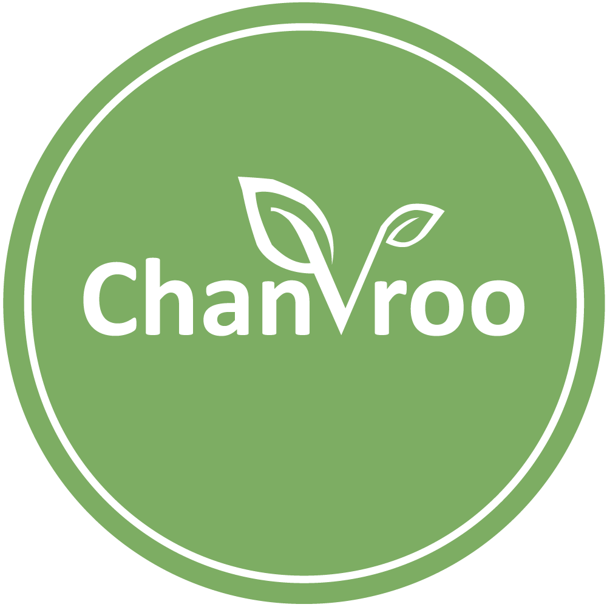

# Chanvroo

> __De nouvelles technologies pour un monde plus écologique__

__Voici la présentation faite lors du _be Mor(e)_ organisé par Startup Maroc__

Bonjour, je m'appelle Jean-Christophe Lepot et je suis étudiant à la codingschool de la __Molengeek__.

__Chanvroo__ sera une solution pour tout le monde afin de vivre dans un monde plus écologique et ainsi résoudre __les problématiques de gaspillage et de pollution__.

## Nous aurons différents produits dans les domaines :
- du textille
- des bio carburants
- dans les matériaux de construction
- Et nous optimeseront nos process dans les domaines de :
	- l'agriculture
	- et de la dépolution des sols

## Ce que nous feront :
Nous exploiteront des champs de chanvre afin de réaliser des vêtements écologiques, des bio carburants et des matériaux écologiques et durables.  
-> Avoir un taux de THC inférieur à 0,3 % (ce qui le rend non hallucinogène)

## Pour mener à bien ce projet, j'aurais besoin de :
* Plantation ou Micro Plantation
* D'entrepôt pour stocker le chanvre
* De matériel industriel
* D'ingénieures dans les domaines des textiles, bio carburants et matériaux
* D'experts en marketing et stratégie de la communication

## Contrairement aux autres concurents 
* En carburant utilisant des énergies fociles 
* En textille utilisant le coton et faisant une sur exploitation des sols finissant par les poluer
* En matériaux qui ne sont pas durable et qui ont une énergie grise trop importante surtout au niveau des bétons

Merci de m'avoir écouté et votez __Chanvroo__ numéro 39 pour un monde plus écologique !